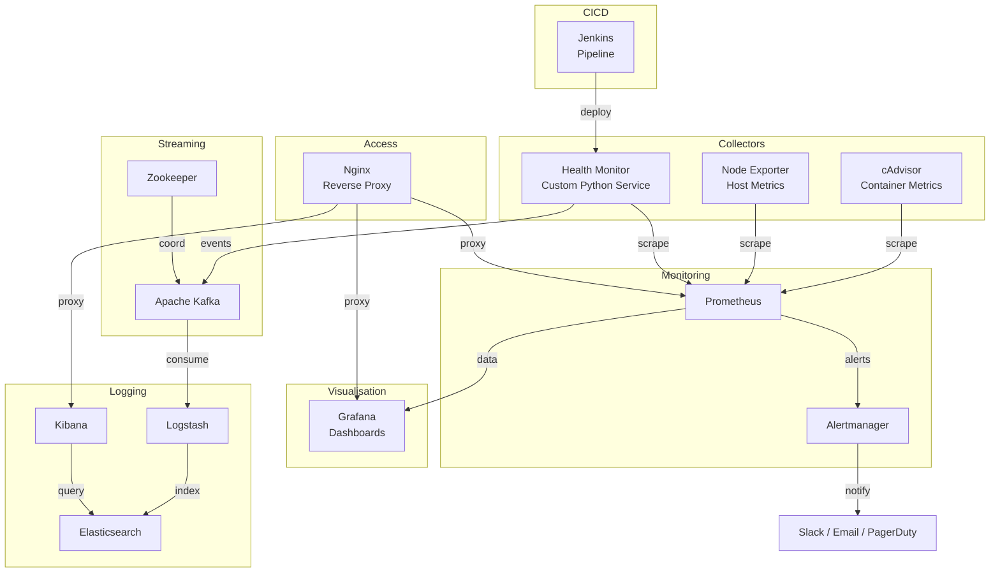

# Scalable Container Health Monitoring System

A production-ready, fully automated container health monitoring and alerting platform built with Prometheus, Grafana, Alertmanager, Apache Kafka, the ELK Stack, and Jenkins CI/CD.

---

## Architecture



---

## Components

| Service | Image | Port | Purpose |
|---|---|---|---|
| Prometheus | `prom/prometheus:v2.48.0` | 9090 | Metrics storage & alerting rules |
| Alertmanager | `prom/alertmanager:v0.26.0` | 9093 | Alert routing (Slack, email, PagerDuty) |
| Grafana | `grafana/grafana:10.2.0` | 3000 | Interactive dashboards |
| cAdvisor | `gcr.io/cadvisor/cadvisor:v0.47.2` | 8080 | Docker container metrics |
| Node Exporter | `prom/node-exporter:v1.7.0` | 9100 | Host OS metrics |
| Zookeeper | `confluentinc/cp-zookeeper:7.5.3` | 2181 | Kafka coordination |
| Kafka | `confluentinc/cp-kafka:7.5.3` | 9092 | Event streaming |
| Kafka UI | `provectuslabs/kafka-ui:v0.7.1` | 8090 | Kafka management console |
| Elasticsearch | `elasticsearch:8.11.0` | 9200 | Log storage & indexing |
| Logstash | `logstash:8.11.0` | 5044 | Log pipeline (Kafka → ES) |
| Kibana | `kibana:8.11.0` | 5601 | Log exploration |
| Health Monitor | Custom Python (FastAPI) | 8000 | Docker watchdog + Kafka producer |
| Nginx | `nginx:1.25-alpine` | 80 | Reverse proxy + auth |
| Jenkins | `jenkins/jenkins:2.426.2-lts-jdk17` | 8081 | CI/CD pipeline |

---

## Quick Start

### Prerequisites

| Requirement | Minimum Version |
|---|---|
| Docker Engine | 24.x |
| Docker Compose | v2.20+ |
| RAM | 8 GB |
| Disk | 20 GB free |
| OS | Linux (recommended), macOS, Windows with WSL2 |

### 1. Clone the repository

```bash
git clone https://github.com/your-org/scalable-container-health-monitoring-system.git
cd scalable-container-health-monitoring-system
```

### 2. One-time setup

```bash
bash scripts/setup.sh
```

This script:
- Validates prerequisites
- Creates `.env` from `.env.example`
- Creates required directories
- Sets `vm.max_map_count=262144` (Linux only — required for Elasticsearch)
- Generates Nginx `.htpasswd` for protected endpoints
- Generates a self-signed TLS certificate

### 3. Configure environment

Edit `.env` and update the values marked with `# CHANGE THIS`:

```bash
nano .env
```

Key sections to review:

| Variable | Default | Description |
|---|---|---|
| `GRAFANA_ADMIN_PASSWORD` | `Admin@Secure123` | Grafana admin password |
| `ELASTIC_PASSWORD` | `Elastic@Secure123` | Elasticsearch + Kibana password |
| `SLACK_WEBHOOK_URL` | _(empty)_ | Slack Incoming Webhook for alerts |
| `PAGERDUTY_SERVICE_KEY` | _(empty)_ | PagerDuty integration key |
| `SMTP_*` | _(empty)_ | Email alert settings |
| `KAFKA_ADVERTISED_HOST` | `kafka` | Kafka advertised hostname |

### 4. Deploy

```bash
bash scripts/deploy.sh
```

For multiple health-monitor replicas:

```bash
bash scripts/deploy.sh 3
```

### 5. Verify

```bash
bash scripts/healthcheck.sh
```

---

## Service URLs

| Service | URL | Credentials |
|---|---|---|
| Grafana | http://localhost:3000 | admin / `$GRAFANA_ADMIN_PASSWORD` |
| Kibana | http://localhost:5601 | elastic / `$ELASTIC_PASSWORD` |
| Prometheus | http://localhost:9090 | admin / `$GRAFANA_ADMIN_PASSWORD` (via Nginx) |
| Alertmanager | http://localhost:9093 | admin / `$GRAFANA_ADMIN_PASSWORD` (via Nginx) |
| Kafka UI | http://localhost:8090 | admin / `$KAFKA_UI_PASSWORD` |
| Health Monitor API | http://localhost:8000 | No auth (internal) |
| Jenkins | http://localhost:8081 | admin / _(initial wizard)_ |

Access all services via the Nginx reverse proxy on **port 80**:

```
http://localhost/grafana/
http://localhost/kibana/
http://localhost/prometheus/   ← basic auth
http://localhost/alertmanager/ ← basic auth
http://localhost/kafka-ui/
http://localhost/monitor/
```

---

## Dashboards

### Container Health Dashboard (`container-health`)

Pre-provisioned in Grafana at **Dashboards → Container Health**.

Panels:
- Running containers count (stat)
- Unhealthy containers count (stat, alerts red)
- Total restarts (stat)
- Average CPU % across containers (stat)
- Average memory % across containers (stat)
- Active Prometheus alerts (stat)
- CPU usage — top-10 containers (time series)
- Memory % — all containers (time series)
- Memory RSS — all containers (time series)
- CPU by container (bar chart)
- Network RX / TX rates (time series)
- Block I/O read / write (time series)
- Container status table (filterable by container name)

### System Overview Dashboard (`system-overview`)

Host-level metrics via Node Exporter:

- Host CPU usage %, memory %, disk %
- System load average (1m, 5m, 15m)
- CPU mode breakdown (user, system, iowait, idle)
- Memory breakdown (used, cached, buffers)
- Disk I/O read / write throughput
- Disk usage by mount point (bar chart)
- Network traffic by interface

---

## Alert Rules

### Container Alerts (`prometheus/alerts/container_alerts.yml`)

| Alert | Severity | Condition |
|---|---|---|
| `ContainerDown` | critical | Container absent from cAdvisor >2m |
| `ContainerOOMKilled` | critical | OOM kill detected |
| `ContainerNotHealthy` | warning | Health status != healthy >5m |
| `ContainerRestartLooping` | warning | >3 restarts in 15m |
| `ContainerHighCPU` | warning | CPU >80% for 5m |
| `ContainerCriticalCPU` | critical | CPU >95% for 2m |
| `ContainerCPUThrottling` | warning | Throttle ratio >50% for 5m |
| `ContainerHighMemory` | warning | Memory >80% for 5m |
| `ContainerCriticalMemory` | critical | Memory >95% for 2m |
| `ContainerMemoryLeak` | warning | Memory growing 100MB/h for 1h |
| `ContainerHighNetworkRx`/`Tx` | warning | >100 MB/s for 5m |
| `ContainerNetworkErrors` | warning | >10 errors/s for 5m |
| `ContainerHighDisk` | warning | Block I/O >50 MB/s for 5m |

### Host Alerts (`prometheus/alerts/host_alerts.yml`)

| Alert | Severity | Condition |
|---|---|---|
| `HostHighCPU` | warning | CPU >80% for 10m |
| `HostHighMemory` | warning | Memory >80% for 5m |
| `HostDiskSpaceLow` | warning | Disk >80% used |
| `HostDiskSpaceCritical` | critical | Disk >95% used |
| `HostDiskFillingSoon` | warning | Predicted full within 4h |
| `HostNetworkErrors` | warning | >100 errors/min |
| `HostClockSkew` | warning | NTP drift >0.5s |

### Kafka / ELK Alerts (`prometheus/alerts/kafka_alerts.yml`)

| Alert | Severity | Condition |
|---|---|---|
| `KafkaBrokerDown` | critical | JMX endpoint unreachable |
| `KafkaUnderReplicatedPartitions` | warning | Under-replicated >0 |
| `KafkaConsumerGroupLag` | warning | Lag >1000 for 5m |
| `ElasticsearchClusterRed` | critical | Cluster status = red |
| `ElasticsearchClusterYellow` | warning | Cluster status = yellow >10m |
| `LogstashDown` | critical | Logstash endpoint unreachable |

---

## Kafka Topics

| Topic | Partitions | Retention | Description |
|---|---|---|---|
| `container-health-events` | 3 | 7 days | Periodic container health snapshots |
| `container-alert-events` | 1 | 30 days | Threshold breach alerts |
| `container-log-events` | 3 | 3 days | Container log lines via health-monitor |
| `container-metrics-raw` | 3 | 24 hours | Raw Docker stats payloads |
| `dead-letter-queue` | 1 | 7 days | Failed events for replay |

Events are produced by the **health-monitor** service and consumed by **Logstash** into Elasticsearch.

---

## Health Monitor API

The custom Python service (`health-monitor/`) exposes:

| Endpoint | Method | Description |
|---|---|---|
| `/health` | GET | Liveness probe — always 200 if process is alive |
| `/ready` | GET | Readiness probe — 200 when Docker + Kafka are connected |
| `/metrics` | GET | Prometheus exposition format |

### Key Metrics Exposed

| Metric | Type | Description |
|---|---|---|
| `container_status` | Gauge | 1=running, 0=stopped |
| `container_health_status` | Gauge | 1=healthy, 0=unhealthy, -1=no healthcheck |
| `container_cpu_percent` | Gauge | CPU utilisation % |
| `container_memory_usage_bytes` | Gauge | RSS memory in bytes |
| `container_memory_percent` | Gauge | Memory % of limit |
| `container_network_rx_bytes_total` | Gauge | Cumulative network received |
| `container_network_tx_bytes_total` | Gauge | Cumulative network transmitted |
| `container_blkio_read_bytes_total` | Gauge | Block reads |
| `container_blkio_write_bytes_total` | Gauge | Block writes |
| `container_restart_count` | Gauge | Restart count |
| `kafka_events_produced_total` | Counter | Successfully produced Kafka events |
| `kafka_events_failed_total` | Counter | Failed Kafka produce attempts |
| `scrape_duration_seconds` | Histogram | Time to complete one monitoring cycle |

### Configuration

| Environment Variable | Default | Description |
|---|---|---|
| `MONITOR_INTERVAL_SECONDS` | `30` | Scrape interval for container stats |
| `CPU_ALERT_THRESHOLD` | `80.0` | CPU % to fire alert event to Kafka |
| `MEMORY_ALERT_THRESHOLD` | `80.0` | Memory % to fire alert event |
| `RESTART_ALERT_THRESHOLD` | `5` | Restart count to fire alert |
| `KAFKA_BOOTSTRAP_SERVERS` | `kafka:9092` | Kafka broker address |
| `KAFKA_TOPIC_HEALTH` | `container-health-events` | Health snapshot topic |
| `KAFKA_TOPIC_ALERTS` | `container-alert-events` | Alert events topic |
| `EXCLUDED_CONTAINERS` | _(empty)_ | Comma-separated container names to skip |

---

## CI/CD Pipeline (Jenkins)

The `Jenkinsfile` defines a 12-stage declarative pipeline:

```
Checkout → Lint (parallel) → Security Scan → Unit Tests
  → Docker Build → Container Scan (Trivy)
  → Push Image → Deploy Staging → Integration Tests
  → Manual Approval → Deploy Production → Smoke Tests
```

### Stage Details

| Stage | Tool | Failure Action |
|---|---|---|
| Code Quality | Flake8, Black, MyPy, YAML lint | Fail build |
| Security Scan | Bandit | Mark unstable |
| Unit Tests | pytest + coverage | Fail build |
| Container Scan | Trivy (HIGH/CRITICAL vulns) | Mark unstable |
| Push Image | Docker registry | Fail build |
| Deploy Staging | `docker compose up` | Fail build |
| Integration Tests | curl-based health checks | Fail build |
| Deploy Production | `docker compose up` | Require manual approval gate |
| Smoke Tests | Endpoint health checks | Notify only |

### Jenkins Setup

1. Access Jenkins at http://localhost:8081
2. Complete the initial setup wizard
3. Install plugins: Docker Pipeline, Credentials Binding, Blue Ocean
4. Create a Pipeline job pointing to this repository
5. Add credentials: `docker-registry-credentials`, `env-file-credentials`

---

## Scaling

### Horizontal scaling — health-monitor replicas

```bash
docker compose up -d --scale health-monitor=3 health-monitor
```

Nginx load-balances across replicas. Each replica exposes its own `/metrics` endpoint.

### Kafka partitions

Increase partitions for higher throughput:

```bash
docker exec kafka kafka-topics \
  --alter --topic container-health-events \
  --partitions 6 \
  --bootstrap-server localhost:9092
```

### Elasticsearch index tuning

Edit `logstash/pipeline/main.conf`:

```ruby
output {
  elasticsearch {
    index => "container-health-%{+YYYY.MM.dd}"
    # Add shards/replicas settings here
  }
}
```

---

## Troubleshooting

### Elasticsearch fails to start

```bash
# Check vm.max_map_count (Linux)
cat /proc/sys/vm/max_map_count
# Should be 262144 or higher
sudo sysctl -w vm.max_map_count=262144
```

### Kafka topics missing

```bash
docker compose up --no-deps kafka-init
```

### Health-monitor can't connect to Docker

Ensure the Docker socket is mounted in `docker-compose.yml`:

```yaml
volumes:
  - /var/run/docker.sock:/var/run/docker.sock:ro
```

### Prometheus targets showing DOWN

```bash
# Check Prometheus target page
curl http://localhost:9090/api/v1/targets | python3 -m json.tool | grep health
```

### Grafana shows "No data"

1. Open Grafana → Configuration → Data Sources → Prometheus
2. Click **Test** — should show "Data source is working"
3. Check that Prometheus is scraping targets correctly

### View service logs

```bash
docker compose logs -f prometheus
docker compose logs -f health-monitor
docker compose logs -f kafka
docker compose logs -f elasticsearch
```

---

## Security Considerations

- **Non-root containers**: The health-monitor runs as user `monitor:1001`
- **Network isolation**: Services are segmented into four bridge networks
  - `monitoring` — Prometheus, Grafana, exporters
  - `kafka-net` — Kafka, Zookeeper, Kafka UI
  - `elk-net` — Elasticsearch, Logstash, Kibana
  - `proxy` — Nginx + services that need HTTP access
- **Nginx basic auth**: Prometheus and Alertmanager UIs are password-protected
- **Resource limits**: All services have `mem_limit` and `cpus` caps in docker-compose.yml
- **Read-only Docker socket**: Health-monitor mounts Docker socket as `:ro`
- **Secrets via environment**: Passwords and keys are loaded from `.env`, never hard-coded
- **Bandit scanning**: The Jenkins pipeline runs Bandit static analysis on the Python service

---

## Project Structure

```
.
├── docker-compose.yml              # Full stack orchestration (14 services)
├── .env.example                    # Environment variable template
├── Jenkinsfile                     # 12-stage CI/CD pipeline
├── prometheus/
│   ├── prometheus.yml              # Scrape configs (13 targets)
│   ├── alerts/
│   │   ├── container_alerts.yml   # Container-level rules
│   │   ├── host_alerts.yml        # Host-level rules
│   │   ├── kafka_alerts.yml       # Kafka + ELK rules
│   │   └── elk_alerts.yml         # Kibana availability
│   └── rules/
│       └── recording_rules.yml    # Pre-computed queries
├── alertmanager/
│   ├── config.yml                  # Routing + receivers
│   └── templates/
│       └── default.tmpl           # HTML + Slack templates
├── grafana/
│   ├── grafana.ini
│   └── provisioning/
│       ├── datasources/
│       └── dashboards/
│           └── json/
│               ├── container-health.json
│               └── system-overview.json
├── kafka/
│   └── scripts/
│       └── create-topics.sh       # Initialises 5 Kafka topics
├── logstash/
│   ├── config/logstash.yml
│   └── pipeline/main.conf         # Kafka → Elasticsearch pipeline
├── kibana/kibana.yml
├── nginx/nginx.conf                # Reverse proxy + rate limiting
├── health-monitor/
│   ├── Dockerfile                  # Non-root, multi-stage build
│   ├── requirements.txt
│   ├── main.py                     # FastAPI entry point
│   └── src/
│       ├── config.py              # Pydantic Settings
│       ├── monitor.py             # Docker stats collection engine
│       ├── kafka_producer.py      # Resilient Kafka producer (tenacity)
│       ├── metrics.py             # 20+ Prometheus metric definitions
│       └── logger.py              # Structured JSON logging
├── scripts/
│   ├── setup.sh                    # First-run setup wizard
│   ├── deploy.sh                   # Ordered deployment script
│   └── healthcheck.sh              # Full system health verification
└── health-monitor/tests/
    ├── test_monitor.py             # Unit tests for monitoring engine
    └── test_metrics.py             # Prometheus metrics registration tests
```

---

## License

MIT — see [LICENSE](LICENSE) for details.
